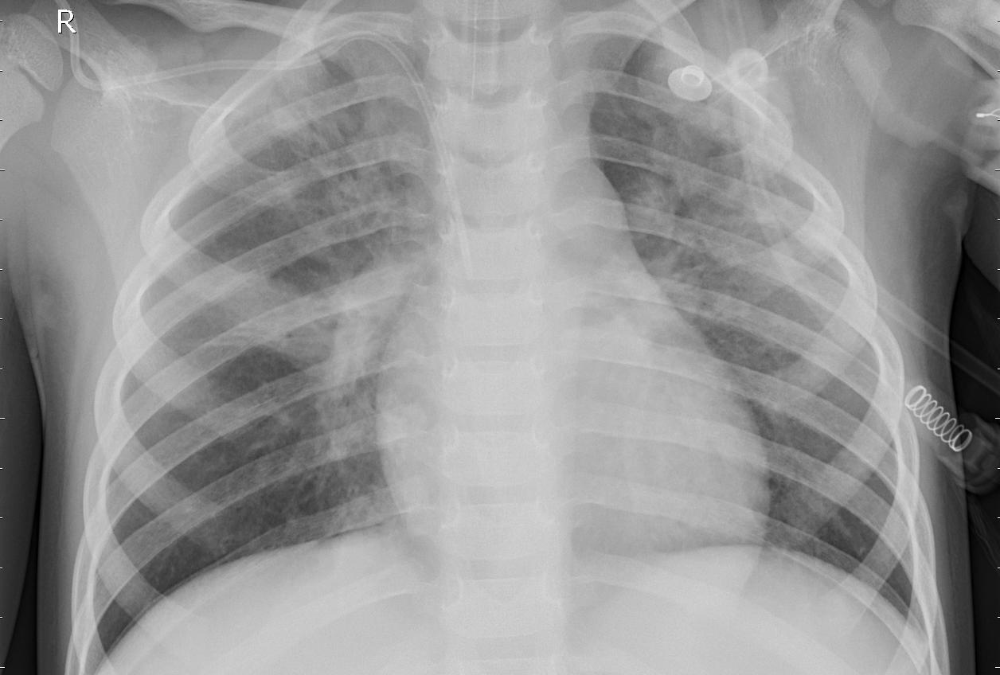

# Detecting Pneumonia from X-ray Scans

I am using the [Chest X-Ray Images (Pneumonia)](https://www.kaggle.com/paultimothymooney/chest-xray-pneumonia) dataset from Kaggle to train a simple CNN for pneumonia detection. The dataset splits pneumonia into two categories: viral and bacterial. The model does not differentiate between these two categories.



## Model Deployment

Classifier is deployed via FastAPI + Docker. The endpoint accepts uploaded files and infers from the image whether there is pneumonia.

Next steps: push to a public URL.

## Setting up Locally

Steps to spin the server on your local network:

1. Setup Docker
2. Run `pip install -r requirements.txt`
3. Create a Kaggle account and generate an API token from `kaggle.com/USERNAME/account` (this will prompt you to download a `kaggle.json` file which contains the credentials)
4. a) Set the Kaggle credentials as environment variables with:
```
export KAGGLE_USERNAME = [kaggle username]
export KAGGLE_KEY = [generated key]
```
4. b) OR use `direnv` to populate credentials in `.envrc` (see `.envrc.example` for formatting)
5. Run `python classifier/train.py` to train the model (Note: this step is optional as repo already comes with model weights)
6. Build Docker container using `docker build . -t app`
7. Run container using `docker run -d -p 8080:5000 app`

This deploys the app to local network `http://localhost:8080/`. You may have to replace `localhost` with your ip address if it doesn't work.

## Making Requests

The easiest way to make a POST request is to go to `http://localhost:8080/docs` and uploading an image from there.

TODO: add pictures here to show how it's done